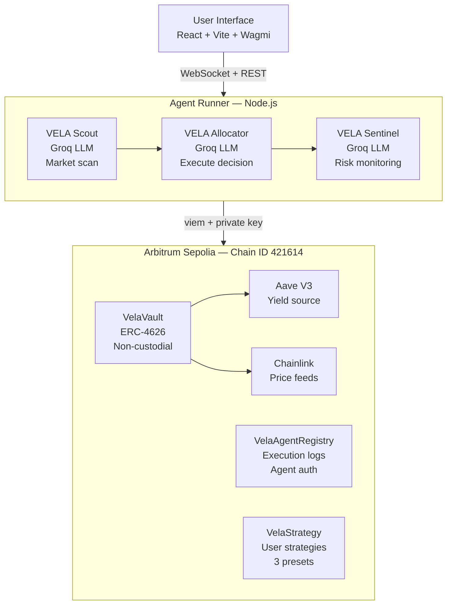

# VELA — Autonomous DeFi Portfolio Manager


> **Your capital works 24/7. You do nothing.**

VELA is a non-custodial, AI-agent-powered DeFi portfolio manager deployed on Arbitrum. Deposit USDC into a smart vault, configure your strategy in plain English, and three specialized AI agents handle everything — farming yield on Aave, rebalancing positions, and defending against risk — without a single wallet popup.

Every agent decision is reasoned by a Groq LLM and permanently logged onchain. Full transparency. Full custody. Zero manual intervention.

| | |
|---|---|
| **Live App** | https://vela-ten-roan.vercel.app |
| **VelaVault** | `0xaD7E5ACaCc8989850bF27b4Fa25ff4f922106386` |
| **VelaAgentRegistry** | `0x2518853d8a6799734ded70857F0cFFC26a175C14` |
| **VelaStrategy** | `0x02185363c7d89A98FA5E1f1596a1fe52f5e250ca` |
| **Network** | Arbitrum Sepolia (Chain ID 421614) |
| **GitHub** | https://github.com/0xkinno/vela |
| **Track** | Arbitrum Open House London — Best Agentic Project |

---

## The Problem

DeFi yields exist everywhere on Arbitrum — Aave lending rates, Uniswap LP fees, stablecoin pools. Capturing them consistently requires monitoring rates 24/7, rebalancing when conditions shift, exiting to safety when risk spikes, and executing dozens of transactions per week.

Most users leave capital idle earning nothing, or spend hours managing positions manually and still miss optimal windows. The few automated solutions that exist are custodial — you hand over your keys.

**VELA solves this without taking custody of a single token.**

---

## What VELA Does

1. **Deposit USDC** into a non-custodial ERC-4626 vault on Arbitrum
2. **Set a strategy** — pick a preset or write plain English rules
3. **Three AI agents activate** and manage your portfolio autonomously
4. **Earn real yield** from Aave V3 while watching every agent decision in real time
5. **Withdraw anytime** — no lockups, no permission needed

---

## The Three Agents

| Agent | Role | What It Does |
|---|---|---|
| **VELA Scout** | Market Intelligence | Reads Chainlink price feeds, Aave APY rates, gas prices, and market context every cycle. Produces a structured market report with sentiment, risk level, and opportunity assessment. |
| **VELA Allocator** | Portfolio Execution | Receives Scout's report, decides allocation changes based on user strategy, executes onchain transactions with full LLM reasoning committed permanently to VelaAgentRegistry. |
| **VELA Sentinel** | Risk Guardian | Monitors positions every 2 minutes independently. Watches for price crashes, protocol anomalies, and liquidation risk. Can trigger emergency exit to pull all funds to liquid USDC. |

---

## Architecture



---

## Agent Decision Flow

```
Every 5 minutes:

  Scout reads onchain data
  ├── Chainlink ETH/USD price
  ├── Aave USDC supply APY
  ├── Vault TVL + liquid balance
  └── Gas price on Arbitrum
          │
          ▼
  Scout sends market report to Allocator
          │
          ▼
  Allocator evaluates:
  ├── Is drift > 5% from strategy target?
  ├── Is risk LOW or MEDIUM?
  ├── Is there enough liquid USDC?
  └── Keep minimum 10% liquid always
          │
       ┌──┴──┐
       ▼     ▼
   EXECUTE  HOLD
   Onchain  Log
   tx +     reasoning
   reasoning only
       │
       ▼
  VelaAgentRegistry.validateAndLog()
  Reasoning string → permanent onchain record

  Every 2 minutes (independent):

  Sentinel checks:
  ├── ETH price drop > 20%?
  ├── Aave APY = 0 (protocol issue)?
  └── Vault emergency mode triggered?
          │
       ┌──┴──┐
       ▼     ▼
  EMERGENCY  ALL
  EXIT       CLEAR
  All funds  Health
  → USDC     score logged
```

---

## Smart Contracts

### VelaVault — ERC-4626
The core vault. Users deposit USDC and receive `velaUSDC` shares representing proportional ownership. Agents interact with Aave through the vault — they can never withdraw to external addresses. Emergency mode can be triggered by Sentinel to pull all funds back to liquid USDC instantly.

### VelaAgentRegistry
Every agent action is validated here before execution. The registry checks agent identity, enforces per-transaction value limits, and permanently logs every decision with its reasoning string and timestamp. Anyone can read the full history onchain at any time.

### VelaStrategy
Stores user portfolio strategies. Three preset templates plus fully custom strategies written in plain English. Agents read the active strategy before every decision cycle.

---

## Strategy System

| Strategy | Aave Allocation | Rebalance Trigger | Stop-Loss |
|---|---|---|---|
| Stable Income | 70% | 5% drift | 10% |
| Balanced Growth | 50% | 8% drift | 20% |
| Aggressive Yield | 30% | 15% drift | 35% |

Custom example:
> *"Keep 60% in stablecoins during high volatility. Exit to USDC if ETH drops 15% in 24h. Never allocate more than 20% to a single pool."*

---

## Why This Wins

Most hackathon DeFi projects show a UI wired to a smart contract. VELA is different in four ways:

**1. Agents actually execute.** Not simulated, not mocked. The Allocator calls `agentDeployToAave()` with a real transaction on Arbitrum Sepolia, carrying an LLM-written reasoning string — permanently onchain.

**2. Every decision is auditable.** `VelaAgentRegistry.getExecutionLogs()` returns every action ever taken — agent address, action type, amount, reasoning, timestamp. Any judge can query this on Arbiscan right now.

**3. Non-custodial by design.** Agents are scoped wallets. They can deploy to Aave and rebalance within the vault. They cannot transfer user funds to external addresses — enforced at the smart contract level, not just by policy.

**4. Consumer-facing PMF.** Every crypto holder with idle capital is the target user. The value proposition takes 10 seconds to understand: deposit, earn, agents handle the rest.

---

## Security Properties

- Agents cannot withdraw to external addresses — vault enforces this onchain
- Per-transaction value cap enforced in VelaAgentRegistry
- Emergency exit pulls all funds to liquid USDC — Sentinel only
- ERC-4626 standard — fully compatible with DeFi tooling and auditable
- No admin key can drain user funds — only users can call `withdraw()`
- Open source contracts on Arbiscan

---

## Tech Stack

| Layer | Technology |
|---|---|
| Smart Contracts | Solidity 0.8.24, Hardhat, OpenZeppelin v5, ERC-4626 |
| Blockchain | Arbitrum Sepolia (Chain ID 421614) |
| Agent AI | Groq API — Llama 3.3 70B Versatile |
| Onchain Data | Chainlink price feeds, Aave V3 reserve data |
| Yield Source | Aave V3 on Arbitrum Sepolia |
| Agent Runner | Node.js, Express, WebSocket, viem |
| Frontend | React 18, Vite, Wagmi v2 |
| Wallet Support | MetaMask, Rabby, OKX, Coinbase, WalletConnect |
| Deployment | Vercel (frontend), Railway (agents) |

---

## Running Locally

**Requirements:** Node.js 18+, MetaMask with Arbitrum Sepolia ETH

```bash
# Clone
git clone https://github.com/0xkinno/vela
cd vela

# 1. Contracts (already deployed — skip if not redeploying)
cd contracts
npm install
cp .env.example .env        # fill PRIVATE_KEY + ARBITRUM_SEPOLIA_RPC
npx hardhat compile
npx hardhat run scripts/deploy.js --network arbitrumSepolia

# 2. Agents
cd ../agents
npm install
cp .env.example .env        # fill GROQ_API_KEY + contract addresses
node index.js

# 3. Frontend (new terminal)
cd ../frontend
npm install
cp .env.example .env        # fill contract addresses
npm run dev
# Open http://localhost:3000
```

**Get testnet USDC:** https://faucet.circle.com — select Arbitrum Sepolia

---

## Project Structure

```
vela/
├── contracts/                     Hardhat project
│   ├── contracts/
│   │   ├── VelaVault.sol          ERC-4626 non-custodial vault
│   │   ├── VelaStrategy.sol       Strategy storage + 3 presets
│   │   ├── VelaAgentRegistry.sol  Agent auth + onchain execution logs
│   │   └── interfaces/
│   │       └── IAaveV3.sol
│   ├── scripts/deploy.js
│   └── test/VelaVault.test.js
│
├── agents/                        Node.js autonomous agent runner
│   ├── index.js                   Orchestrator + WebSocket server
│   ├── scout.js                   Market intelligence agent
│   ├── allocator.js               Portfolio execution agent
│   ├── sentinel.js                Risk monitoring agent
│   └── lib/
│       ├── claude.js              Groq LLM wrapper
│       ├── onchain.js             Chainlink + Aave reads
│       └── contracts.js           ABI + execution functions
│
└── frontend/                      React + Vite application
    └── src/
        ├── pages/
        │   ├── Landing.jsx        Homepage + live agent feed
        │   ├── Dashboard.jsx      Portfolio overview
        │   ├── Vault.jsx          Deposit + withdraw
        │   ├── Strategy.jsx       Agent configuration
        │   └── AgentLogs.jsx      Full onchain decision history
        ├── components/
        │   ├── WalletConnect.jsx  Multi-wallet modal
        │   └── AgentFeed.jsx      Live WebSocket feed
        └── hooks/
            ├── useVault.js        Vault reads + writes
            └── useAgentFeed.js    WebSocket + onchain log merger
```

---

## Deployed Contracts

| Contract | Address | Explorer |
|---|---|---|
| VelaVault | `0xaD7E5ACaCc8989850bF27b4Fa25ff4f922106386` | [Arbiscan](https://sepolia.arbiscan.io/address/0xaD7E5ACaCc8989850bF27b4Fa25ff4f922106386) |
| VelaAgentRegistry | `0x2518853d8a6799734ded70857F0cFFC26a175C14` | [Arbiscan](https://sepolia.arbiscan.io/address/0x2518853d8a6799734ded70857F0cFFC26a175C14) |
| VelaStrategy | `0x02185363c7d89A98FA5E1f1596a1fe52f5e250ca` | [Arbiscan](https://sepolia.arbiscan.io/address/0x02185363c7d89A98FA5E1f1596a1fe52f5e250ca) |

---

## Roadmap

- Mainnet deployment on Arbitrum One with real USDC
- Additional yield sources — Uniswap V3 LP, GMX GLP, Pendle PT
- Multi-asset vaults — ETH, WBTC, ARB strategies
- ZeroDev session keys — gasless agent execution
- Strategy marketplace — share and fork community strategies
- Mobile app — monitor portfolio and agent activity anywhere

---

## Team

Solo build — Arbitrum Open House London Buildathon 2025

*VELA — Capital That Never Sleeps, Never Stops, Never Needs You.*
